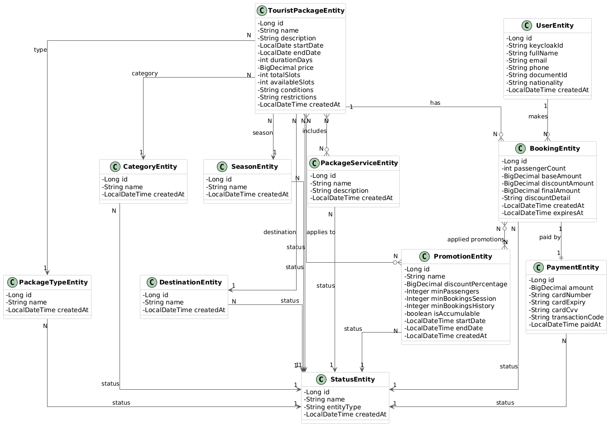

# TravelAgency Backend

Sistema de gestión de paquetes turísticos desarrollado con Spring Boot como arquitectura monolítica por capas.

## Diagrama de clases



## Stack tecnológico

| Componente | Tecnología |
|------------|-----------|
| Backend | Spring Boot 4.0.6 |
| Lenguaje | Java 21 |
| Base de datos | PostgreSQL 18 |
| Autenticación | Keycloak 26.6.2 |
| Build tool | Gradle 8.14 |
| ORM | Spring Data JPA / Hibernate |
| Frontend | ReactJS |
| Despliegue | Docker Compose + Nginx |

## Módulos del sistema

| # | Módulo | Descripción |
|---|--------|-------------|
| 1 | Administracion Usuarios | Registro, autenticación y gestión de perfiles via Keycloak |
| 2 | Gestion Paquetes Turisticos | CRUD de paquetes, control de estados y cupos |
| 3 | Consulta Paquetes Turisticos | Búsqueda y filtrado de paquetes disponibles |
| 4 | Reservas | Proceso de reserva con cálculo de descuentos |
| 5 | Pagos | Flujo de pago simulado con tarjeta de crédito |
| 6 | Consulta Reservas | Seguimiento de reservas y generación de comprobantes |
| 7 | Reportes | Ventas por período y ranking de paquetes |

## Estructura del proyecto

```
src/main/java/com/travelagency/travelagency_backend/
├── config/
│   └── SecurityConfig.java
├── controller/
│   ├── BookingController.java
│   ├── CategoryController.java
│   ├── DestinationController.java
│   ├── PackageServiceController.java
│   ├── PackageTypeController.java
│   ├── PaymentController.java
│   ├── PromotionController.java
│   ├── SeasonController.java
│   ├── StatusController.java
│   ├── TouristPackageController.java
│   └── UserController.java
├── entity/
│   ├── BookingEntity.java
│   ├── CategoryEntity.java
│   ├── DestinationEntity.java
│   ├── PackageServiceEntity.java
│   ├── PackageTypeEntity.java
│   ├── PaymentEntity.java
│   ├── PromotionEntity.java
│   ├── SeasonEntity.java
│   ├── StatusEntity.java
│   ├── TouristPackageEntity.java
│   └── UserEntity.java
├── repository/
│   ├── BookingRepository.java
│   ├── CategoryRepository.java
│   ├── DestinationRepository.java
│   ├── PackageServiceRepository.java
│   ├── PackageTypeRepository.java
│   ├── PaymentRepository.java
│   ├── PromotionRepository.java
│   ├── SeasonRepository.java
│   ├── StatusRepository.java
│   ├── TouristPackageRepository.java
│   └── UserRepository.java
└── service/
    ├── BookingService.java
    ├── CategoryService.java
    ├── DestinationService.java
    ├── PackageServiceService.java
    ├── PackageTypeService.java
    ├── PaymentService.java
    ├── PromotionService.java
    ├── SeasonService.java
    ├── StatusService.java
    ├── TouristPackageService.java
    └── UserService.java
```

## Roles del sistema

| Rol | Descripción |
|-----|-------------|
| `ADMIN` | Acceso completo al sistema. Gestiona usuarios, paquetes, reservas, pagos, promociones y reportes. |
| `CUSTOMER` | Acceso restringido. Consulta paquetes, realiza reservas y pagos, visualiza sus propias reservas. |

## Endpoints principales

| Módulo | Base URL |
|--------|---------|
| Usuarios | `/api/users` |
| Estados | `/api/statuses` |
| Tipos de paquete | `/api/package-types` |
| Destinos | `/api/destinations` |
| Categorías | `/api/categories` |
| Temporadas | `/api/seasons` |
| Servicios | `/api/package-services` |
| Paquetes turísticos | `/api/tourist-packages` |
| Promociones | `/api/promotions` |
| Reservas | `/api/bookings` |
| Pagos | `/api/payments` |

## Configuración local

### Requisitos previos

- Java 21
- PostgreSQL 18
- Keycloak 26.6.2
- Gradle 8.14

### Base de datos

```sql
CREATE DATABASE travelagency;
```

### application.properties

```properties
# Database
spring.datasource.url=jdbc:postgresql://localhost:5432/travelagency
spring.datasource.username=postgres
spring.datasource.password=postgres
spring.datasource.driver-class-name=org.postgresql.Driver

# JPA
spring.jpa.hibernate.ddl-auto=update
spring.jpa.show-sql=true
spring.jpa.properties.hibernate.format_sql=true

# Server
server.port=8081

# Keycloak
spring.security.oauth2.client.registration.keycloak.client-id=travelagency-backend
spring.security.oauth2.client.registration.keycloak.client-secret=<CLIENT_SECRET>
spring.security.oauth2.client.registration.keycloak.scope=openid,profile,email
spring.security.oauth2.client.registration.keycloak.authorization-grant-type=authorization_code
spring.security.oauth2.client.registration.keycloak.redirect-uri=http://localhost:8081/login/oauth2/code/keycloak
spring.security.oauth2.client.provider.keycloak.issuer-uri=http://localhost:9090/realms/travelagency
spring.security.oauth2.resourceserver.jwt.issuer-uri=http://localhost:9090/realms/travelagency
```

### Ejecutar Keycloak

```bash
bin\kc.bat start-dev --http-port=9090
```

### Ejecutar el backend

```bash
./gradlew bootRun
```

## Autenticación

El sistema usa Keycloak como proveedor de identidad. Para obtener un token JWT:

```
POST http://localhost:9090/realms/travelagency/protocol/openid-connect/token

client_id=travelagency-backend
client_secret=<CLIENT_SECRET>
username=<usuario>
password=<contraseña>
grant_type=password
```

Usar el `access_token` en el header de cada request:

```
Authorization: Bearer <access_token>
```

## Despliegue

El despliegue se realiza con Docker Compose incluyendo:
- PostgreSQL
- Backend (3 réplicas)
- Nginx como balanceador de carga
- Frontend React
